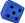
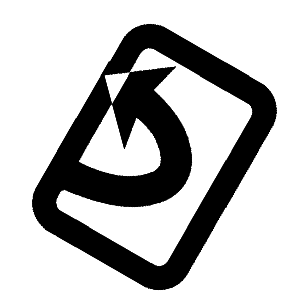
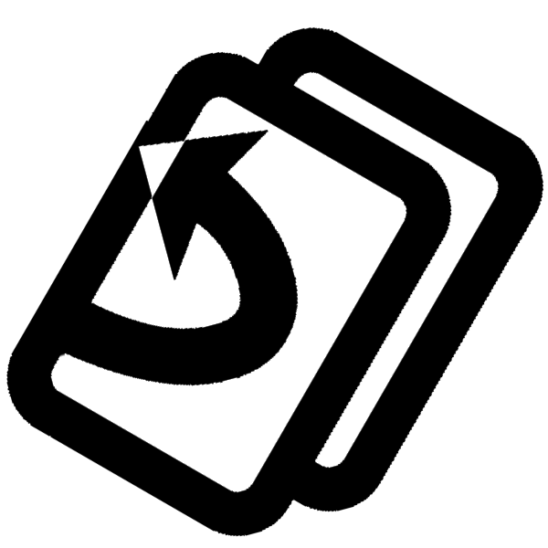
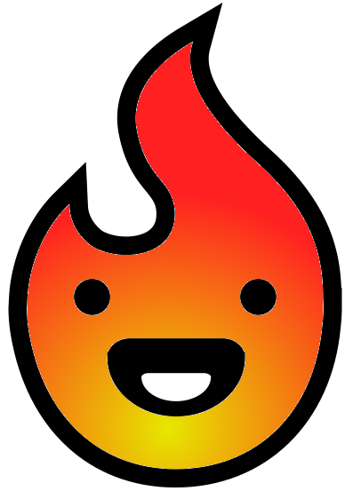

# Lexique des icônes

Mémo visuel pour les joueurs. Descriptions courtes, sans jargon.

## Dés

-  — Tous les dés de la Horde (bleus et violets)
-  — Vos dés (bleu)
-  — Dés à contrer (selon la tuile: vert = terrain, blanc = turbulences)
-  — Aléa / turbulences de l’épreuve (blanc)
   — Les dés verts se résolvent en premier
-  — Dés spéciaux, uniquement contrés par les dés violets
-  — Prenez-en autant que de dés noirs. Seul le moral peut modifier ces dés

## Vent

-  — Représente indifféremment le vent ou sa force (selon le contexte)
-  …  — Force du vent (1 à 6)
  - La force indique combien de dés de la Horde doivent montrer la même valeur.

## Actions

-  — Carte de Hordier
-  — Engager (fatiguer) un Hordier
-  — Redresser (restaurer) un Hordier
-  — Redresser tous les Hordiers fatigués
-  — Abandonner (défausser) un Hordier, ou Hordier abandonné (certains pouvoirs)
-  — Hordier manquant dans l'équipe
-  — Défausser une tuile

## Tuiles

-  — Tuile de terrain

## Ressources

-  — Moral de la Horde
-  — Campement / Repos

## Recrutement et niveaux

-    — Difficulté de la carte
-  — Recruter
-    — Défausser (variante)
-    — Recruter 2 Hordiers

## Divers

-  — Mode 2 joueurs, hordiers qu'il vaut mieux jouer a 2 joueurs et plus.

Astuce: si un pictogramme vous échappe, revenez à ce mémo pendant la lecture des règles ou des cartes.
